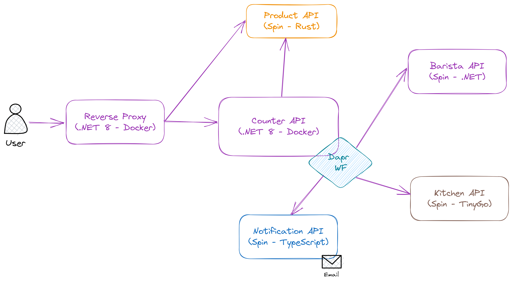

# CoffeeShop Polyglot



## Install dotnet on Ubuntu 22.04

```sh
sudo ./dotnet-install.sh -v 8.0.100-preview.4.23260.5 --install-dir /usr/share/dotnet
```

## Dapr

Upgrade dapr CLI

```sh
wget -q https://raw.githubusercontent.com/dapr/cli/master/install/install.sh -O - | /bin/bash -s 1.11.0-rc.2
```

Init dapr 1.11-rc

```sh
dapr init --runtime-version 1.11.0-rc.7
```