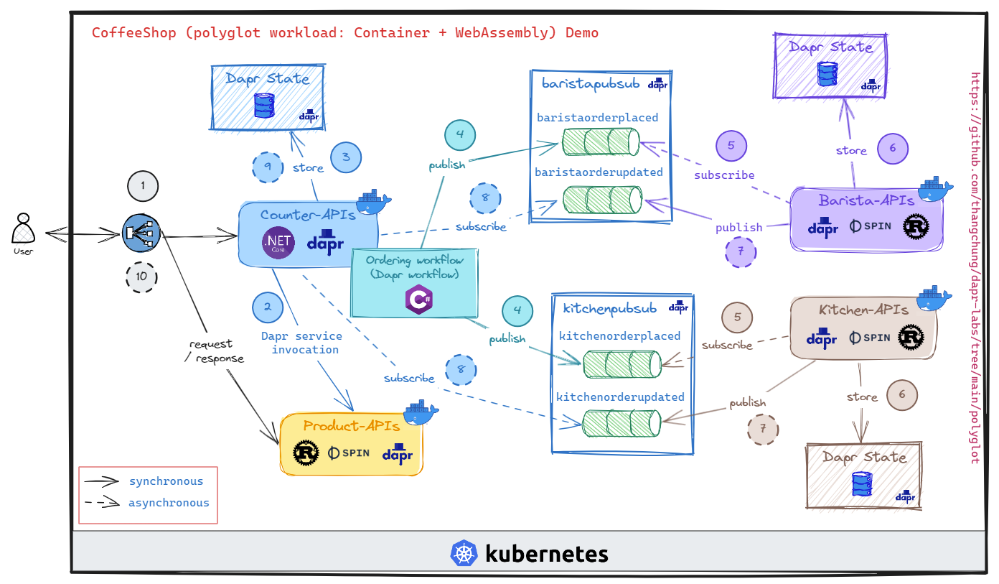

# CoffeeShop Polyglot on Dapr



## Get starting

See how to init [Dapr](#dapr) as below

Create `.env` file as below

```env
DAPR_URL=http://localhost:3500
```

Then, run commands below

```sh
make run-product-dapr
```

```sh
make run-counter-dapr
```

```sh
make run-barista-dapr
```

```sh
make run-kitchen-dapr
```

Then, playing around with it at [client.local.http](client.local.http)!

## Install dotnet on Ubuntu 22.04

```sh
sudo ./dotnet-install.sh -v 8.0.100-preview.4.23260.5 --install-dir /usr/share/dotnet
```

## Dapr

Upgrade dapr CLI

```sh
wget -q https://raw.githubusercontent.com/dapr/cli/master/install/install.sh -O - | /bin/bash -s 1.11.0-rc.2
```

Init dapr 1.11-rc

```sh
dapr init --runtime-version 1.11.0-rc.7
```

## Kubernetes

### kwasm (kind)

Scaffold service (gen Dockerfile and deploy.yaml)

```sh
spin k8s scaffold ghcr.io/dapr-labs
```

Deploy and run

```sh
kind create cluster
kubectl cluster-info --context kind-kind
# Follows guidance at here https://kwasm.sh/quickstart/
kubectl port-forward deployment/product-api 80:80
# cannot load balancer
# todo: dapr init -k 
```

### AKS

TODO

Issue at: https://github.com/fermyon/spin/issues/1069#issuecomment-1586195017

### Trouble shooting

- Error with `docker buildx build ...` with `WSL2` - `Ubuntu 22.02` with `cgroup v2`

  ```
  ERROR: Error response from daemon: cgroup-parent for systemd cgroup should be a valid slice named as "xxx.slice"
  ```

  Fixed it at: https://github.com/containerd/runwasi/issues/288#issuecomment-1707764979

  > we might need to create default builder as

  ```sh
  docker buildx create --use --name builder tcp://builder:2375 --platform linux/amd64,linux/386,linux/arm/v6,linux/arm64,linux/arm/v7 --driver-opt env.BUILDKIT_STEP_LOG_MAX_SIZE=10000000,env.BUILDKIT_STEP_LOG_MAX_SPEED=1000000000
  ```

  `cgroup v2` knowledge => https://blog.kintone.io/entry/2022/03/08/170206
