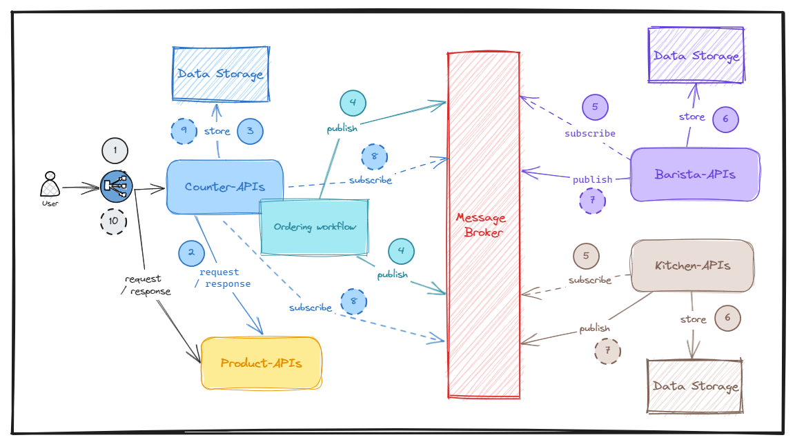
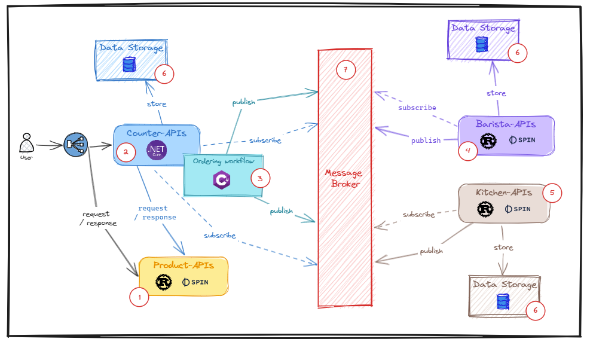
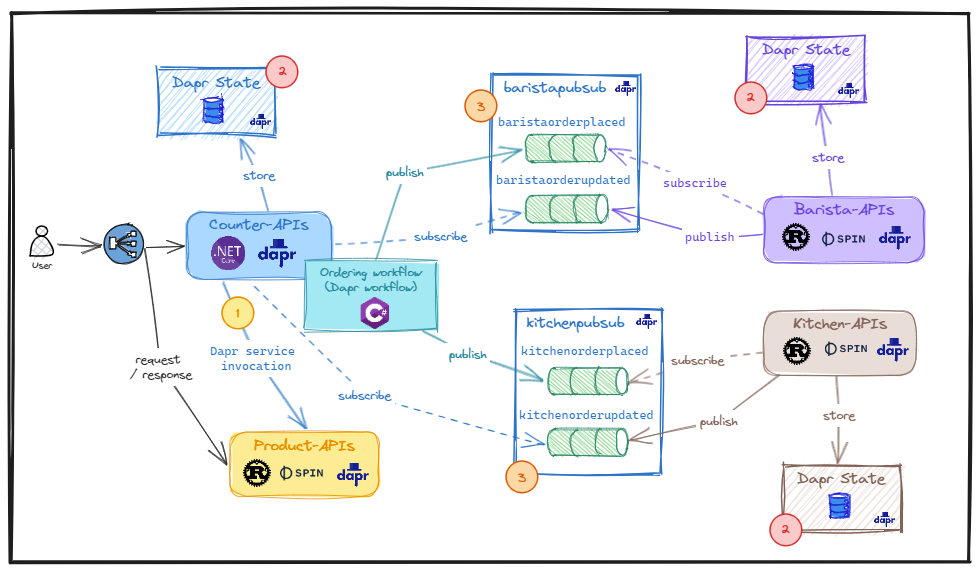
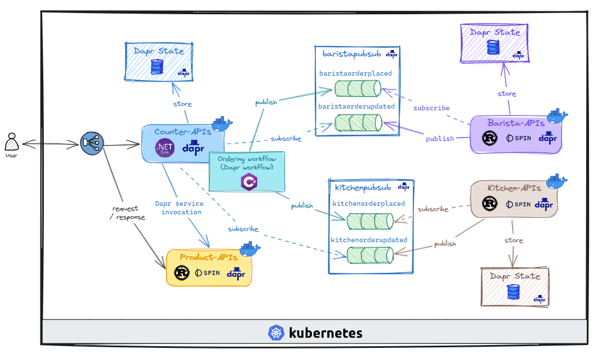

# Better together: A Dapr on Kubernetes and WebAssembly/WASI Apps Series

This series are the journey of how can I research, implement, and deploying the demo application into Kubernetes with Dapr and Spin in-place.

## Experiment: [How to run WebAssembly/WASI application (Spin) with Dapr on Kubernetes?](https://dev.to/thangchung/how-to-run-webassemblywasi-application-spin-with-dapr-on-kubernetes-2b8n)

## Part 1: WebAssembly, Docker container, Dapr, and Kubernetes better together - Demo scenario with coffeeshop application

TODO

## Part 2: WebAssembly, Docker container, Dapr, and Kubernetes better together - Build and run the coffee shop backend services

TODO

## Part 3: WebAssembly, Docker container, Dapr, and Kubernetes better together - Prepare Dapr components and daprize the coffee backend services

TODO

## Part 4: WebAssembly, Docker container, Dapr, and Kubernetes better together - Package the daprized coffee backend services to Docker container and deploy to Kubernetes

TODO
