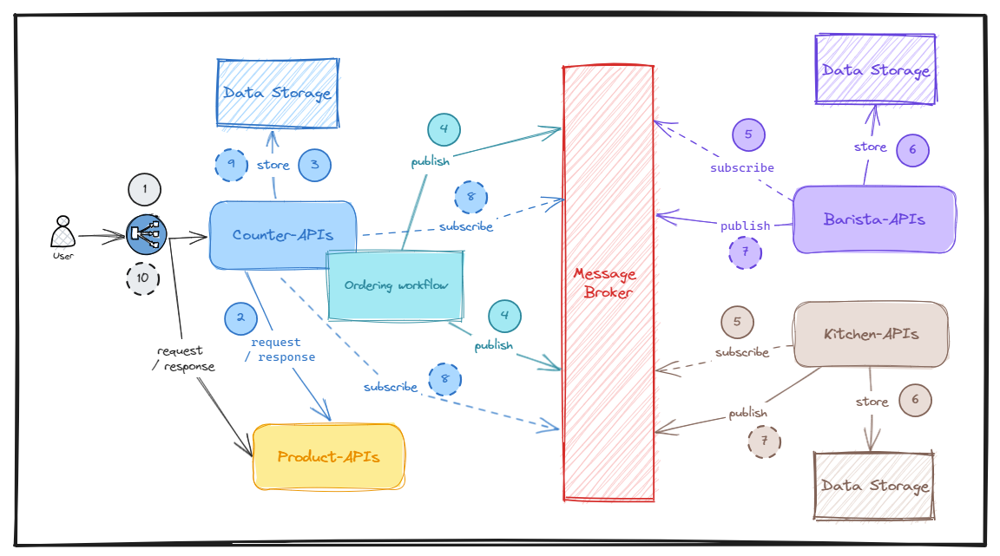

# Part 1: WebAssembly, Docker container, Dapr, and Kubernetes better together - Demo scenario with coffeeshop application

From: [the image from freepik](https://www.freepik.com/free-vector/coffee-shop-color-set_26763954.htm#query=coffeeshop&position=36&from_view=search&track=sph)

To make this series cool and more practical works, we are going to build up the demo application on the coffee shop business domain (partially on this domain, mainly on submitting orders for buying drinks or food, sending requests to baristas or kitchen for fulfillment orders, then back to the user with a status). The reason why we choose this domain is because I love to drink coffee, and many people in my country too. And more importantly, this business domain is quite popular with everyone around the world.

Below is a little bit description of the coffee shop business domain from a technical POV:

1. End-user comes to any coffee shop, for example, she wants to buy `a coffee back (3$)` and `a croissant (3.25$)` so she asks to buy it. A man on the counter will receive the order (normally on a POS device), and submit this request into the system (our APIs).
2. On `counter-api`, we compose the HTTP request to call to `product-api` to query all available items to check whether the items in the end-user order are valid or not.
3. If items are valid, then we create a new order and save it in the `counter-api`'s data storage.
4. To make `counter-api` de-coupling with `barista-api` and `kitchen-api`, we prefer to use [Event-driven Architecture](https://en.wikipedia.org/wiki/Event-driven_architecture) (EDA), and we can use EDA in both orchestrator and choreography communication styles. In this post, we maintain an ordering workflow (orchestrator) that will ensure that we submit 2 events: one for `barista_order_placed` in `barista-api`, and one for `kitchen_order_placed` in `kitchen-api`.
5. At the same time, `barista-api` and `kitchen-api` parallel subscribe to `barista_order_placed` and `kitchen_order_placed` events and process them.
6. The results of this process will be stored in the data storage in each `barista-api` and `kitchen-api`.
7. Then in parallel, `barista-api` and `kitchen-api` will publish `barista_order_updated` and `kitchen_order_updated` events on each side to the message broker, following up with `pub/sub pattern` in EDA (choreography style).
8. `counter-api` will subscribe to `barista_order_updated` and `kitchen_order_updated` events from the message broker, and based on the result process, and updating the current order.
9. The end of this process is storing the updated order in the data storage (the previous step).
10. The result will return back to the end-user (it might succeed or fail).

> Notes: The end-user can query the specific order by on the identity that she gives for the counter.

The next post will be fun and interesting because we will deep dive into the technical parts to solve the business model above using modern technologies with WebAssembly, Docker container, Dapr, and Kubernetes.
