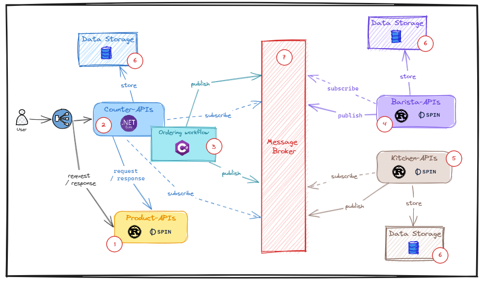

# Part 2: WebAssembly, Docker container, Dapr, and Kubernetes better together - Build and run the coffee shop backend services

In previous part, we explored the coffee shop business domain and mastered what we need to implement it. In term of modern architecture, we need to choose what kind of technologies need to focus on to build out the whole solution.

In this part, we will have a look at core components (the data storage and the message broker) and services (`product-api`, `counter-api`, `barista-api`, and `kitchen-api`) in details. But first, we list out what programming language and framework for each service below.

- `product-api`: Rust, Spin (a framework for building, deploying, and running fast, secure, and composable cloud microservices with WebAssembly).
- `counter-api`: .NET 8 and C# 12, Dapr workflow (an asynchronous durable framework makes it easy for developers to write business logic and integrations in a reliable way).
- `barista-api`: Rust, Spin
- `kitchen-api`: Rust, Spin

## Backend services on a holistic view



### Preparation

On Windows 11 - WSL2 - `Ubuntu 22.04` (I think if you use other Linux distros, then it should work too)

Install .NET 8

```sh
# ref: https://learn.microsoft.com/en-us/dotnet/core/install/linux-scripted-manual#scripted-install
> wget https://dot.net/v1/dotnet-install.sh -O dotnet-install.sh
> chmod +x ./dotnet-install.sh
> ./dotnet-install.sh --channel 8.0.1xx --quality preview
```

Install Rust

```sh
# ref: https://rustup.rs/
> curl --proto '=https' --tlsv1.2 -sSf https://sh.rustup.rs | sh
```

Install Spin

```sh
# ref: https://developer.fermyon.com/spin/quickstart
> rustup target add wasm32-wasi # we need to build WASM/WASI
> curl -fsSL https://developer.fermyon.com/downloads/install.sh | bash && mv spin /usr/local/bin/
> spin plugin install js2wasm -y # in case, we need to compile to js
> spin templates install --git https://github.com/fermyon/spin --update
```

### 1. Product-API

```sh
> spin new
```

Choose `http-rust`, then type a name is `product-api`, you can see the structure as:

```sh
> cd product-api
> tree
.
├── Cargo.lock
├── Cargo.toml
├── deploy.yaml
├── Dockerfile
├── spin.toml
└── src
    └── lib.rs
```

After implement the business features for `get-all-items` and `get-item-by-types` below

```rs
// ref: https://github.com/thangchung/dapr-labs/blob/main/polyglot/product-api/src/lib.rs#L12

#[derive(Debug, Serialize, Clone)]
#[serde(rename_all = "camelCase")]
struct ItemType {
    name: String,
    item_type: i8,
    price: f32,
    image: String,
}

#[derive(Debug, Deserialize)]
struct GetItemByTypeModel{
    types: String,
}

impl TryFrom<&Option<Bytes>> for GetItemByTypeModel {
    type Error = anyhow::Error;

    fn try_from(value: &Option<Bytes>) -> std::result::Result<Self, Self::Error> {
        match value {
            Some(b) => Ok(serde_json::from_slice::<GetItemByTypeModel>(b)?),
            None => Err(anyhow::anyhow!("No body")),
        }
    }
}

#[http_component]
fn handle_product_api(req: Request) -> Result<Response> {
    println!("{:?}", req.headers());

    let mut router = spin_sdk::http::Router::default();
    router.get("/", health_handler);
    router.get("/v1-get-item-types", get_item_types_handler);
    router.get("/v1-get-items-by-types", get_item_by_types_handler);
    router.handle(req)
}

fn health_handler(_req: Request, _params: Params) -> Result<Response> {
    Ok(http::Response::builder()
        .status(200)
        .body(Some("".into()))?)
}

fn get_item_types_handler(_req: Request, _params: Params) -> Result<Response> {
    let items = json!(get_item_types());
    let result = bytes::Bytes::from(items.to_string());
    Ok(http::Response::builder()
        .header("Content-Type", "application/json")
        .status(200)
        .body(Some(result))?)
}

fn get_item_by_types_handler(req: Request, _params: Params) -> Result<Response> {
    let Ok(model) = GetItemByTypeModel::try_from(&req.body().clone()) else {
        return Ok(http::Response::builder()
        .status(http::StatusCode::BAD_REQUEST)
        .body(None)?);
    };

    let mut temp: Vec<ItemType> = Vec::new();

    for i in get_item_types() {
        let parts = model.types.split(',');

        let ii = i.clone();
        for j in parts {
            if ii.item_type.to_string().as_str() == j {
                temp.push(ii.clone())
            }
        }
    } 

    let result = bytes::Bytes::from(json!(temp).to_string());
    Ok(http::Response::builder()
        .header("Content-Type", "application/json")
        .status(200)
        .body(Some(result))?)
}

fn get_item_types() -> Vec<ItemType> {
    vec![
        ItemType {
            name: "CAPPUCCINO".to_string(),
            item_type: 0,
            price: 4.5,
            image: "img/CAPPUCCINO.png".to_string(),
        },
        // ...
        ItemType {
            name: "CROISSANT".to_string(),
            item_type: 7,
            price: 3.25,
            image: "img/CROISSANT.png".to_string(),
        },
        // ...
    ]
}
```

Now, you should run it:

```sh
> spin build
> spin up --listen 0.0.0.0:5001
```

The source code can be found at [product-api](https://github.com/thangchung/dapr-labs/tree/main/polyglot/product-api).

> But, if you want to make it work on the runtime, you need to daprize it with `daprd`. See next part for it.

### 2. Counter-API

```sh
> dotnet new sln --coffeeshop
> dotnet new api --name counter-api --framework net8.0
> dotnet sln coffeeshop.sln add counter-api.csproj
```

Then we add and structure it as `Clean Architecture` structure folder:

```sg
> tree
.
├── Activities
│   ├── AddOrderActivity.cs
│   ├── NotifyActivity.cs
│   └── UpdateOrderActivity.cs
├── appsettings.Development.json
├── appsettings.json
├── counter-api.csproj
├── Domain
│   ├── Commands
│   │   └── PlaceOrderCommand.cs
│   ├── DomainEvents
│   │   ├── OrderIn.cs
│   │   ├── OrderUp.cs
│   │   └── OrderUpdate.cs
│   ├── Dtos
│   │   └── ItemDto.cs
│   ├── IItemGateway.cs
│   ├── ItemStatus.cs
│   ├── ItemType.cs
│   ├── Location.cs
│   ├── Messages
│   │   ├── OrderPlaced.cs
│   │   └── OrderUpdated.cs
│   ├── Order.cs
│   ├── OrderSource.cs
│   ├── OrderStatus.cs
│   └── SharedKernel
│       └── Events.cs
├── Extensions
│   └── OpenTelemetryExtensions.cs
├── Infrastructure
│   └── ItemDaprGateway.cs
├── Program.cs
├── Properties
│   └── launchSettings.json
├── UseCases
│   ├── OrderFulfillmentQuery.cs
│   ├── OrderUpdatedCommand.cs
│   └── PlaceOrderCommand.cs
└── Workflows
    └── PlaceOrderWorkflow.cs
```

Now, we wire up all components in `Program.cs` below

```cs
// ref: https://github.com/thangchung/dapr-labs/blob/main/polyglot/counter-api/Program.cs

var builder = WebApplication.CreateBuilder(args);

builder.Services.AddDaprWorkflow(options =>
{
    options.RegisterWorkflow<PlaceOrderWorkflow>();

    options.RegisterActivity<NotifyActivity>();
    options.RegisterActivity<AddOrderActivity>();
    options.RegisterActivity<UpdateOrderActivity>();
});

builder.Services.AddHttpContextAccessor();
builder.Services.AddMediatR(cfg => cfg.RegisterServicesFromAssemblyContaining<Program>());
builder.Services.AddValidatorsFromAssemblyContaining<Program>();

builder.Services.AddEndpointsApiExplorer();
builder.Services.AddSwaggerGen();

builder.Services.AddDaprClient();
builder.Services.AddSingleton(new JsonSerializerOptions()
{
    PropertyNamingPolicy = JsonNamingPolicy.CamelCase,
    PropertyNameCaseInsensitive = true,
});

builder.Services.AddScoped<IItemGateway, ItemDaprGateway>();

if (string.IsNullOrEmpty(Environment.GetEnvironmentVariable("DAPR_GRPC_PORT")))
{
    Environment.SetEnvironmentVariable("DAPR_GRPC_PORT", "50001");
}

builder.AddOpenTelemetry();

var app = builder.Build();

if (app.Environment.IsDevelopment())
{
    app.UseSwagger();
    app.UseSwaggerUI();
}

app.UseRouting();
app.UseCloudEvents();

app.Map("/", () => Results.Redirect("/swagger"));

_ = app.MapOrderInApiRoutes()
    .MapOrderUpApiRoutes()
    .MapOrderFulfillmentApiRoutes();

// Configure the prometheus endpoint for scraping metrics
// app.MapPrometheusScrapingEndpoint();
// NOTE: This should only be exposed on an internal port!
// .RequireHost("*:9100");

app.Run();
```

See more source code at [counter-api](https://github.com/thangchung/dapr-labs/tree/main/polyglot/counter-api).

> But, if you want to make it work on the runtime, you need to daprize it with `daprd`. See next part for it.

### 3. Ordering workflow

The activity diagram for this workflow:


The code using `Dapr Workflow` framework (the mechanism to build this workflow-as-code is just like Temporal, Azure Durable Functions,...)

```cs
// ref: https://github.com/thangchung/dapr-labs/blob/main/polyglot/counter-api/Workflows/PlaceOrderWorkflow.cs

public class PlaceOrderWorkflow : Workflow<PlaceOrderCommand, PlaceOrderWorkflowResult>
{
    public override async Task<PlaceOrderWorkflowResult> RunAsync(WorkflowContext context, PlaceOrderCommand input)
    {
        var retryOptions = new WorkflowTaskOptions
        {
            RetryPolicy = new WorkflowRetryPolicy(
                firstRetryInterval: TimeSpan.FromMinutes(1),
                backoffCoefficient: 2.0,
                maxRetryInterval: TimeSpan.FromHours(1),
                maxNumberOfAttempts: 10),
        };

        input.OrderId = new Guid(context.InstanceId);

        await context.CallActivityAsync(
            nameof(NotifyActivity),
            new Notification($"Received order {context.InstanceId}"),
            retryOptions);

        var result = await context.CallActivityAsync<PlaceOrderResult>(
            nameof(AddOrderActivity),
            input,
            retryOptions);

        if (result.Success)
        {
            try
            {
                // Pause and wait for barista & kitchen event
                context.SetCustomStatus("Waiting for barista & kitchen events");
                var baristaOrderUpdatedEvent = context.WaitForExternalEventAsync<BaristaOrderUpdated>(
                    eventName: "BaristaOrderUpdated",
                    timeout: TimeSpan.FromSeconds(30)); //todo: read from inputParams, make sure it is deterministic

                var kitchenOrderUpdatedEvent = context.WaitForExternalEventAsync<KitchenOrderUpdated>(
                    eventName: "KitchenOrderUpdated",
                    timeout: TimeSpan.FromSeconds(30)); //todo: read from inputParams, make sure it is deterministic

                await Task.WhenAll(baristaOrderUpdatedEvent, kitchenOrderUpdatedEvent);

                var baristaOrderUpdatedResult = await baristaOrderUpdatedEvent;
                var kitchenOrderUpdatedResult = await kitchenOrderUpdatedEvent;

                // merge items
                foreach (var temp in kitchenOrderUpdatedResult.ItemLines)
                {
                    baristaOrderUpdatedResult.ItemLines.Add(temp);
                }

                await context.CallActivityAsync(
                    nameof(UpdateOrderActivity),
                    baristaOrderUpdatedResult,
                    retryOptions);

                context.SetCustomStatus($"Order {context.InstanceId} completed.");

                await context.CallActivityAsync(
                    nameof(NotifyActivity),
                    new Notification($"Completed: order {context.InstanceId}"),
                    retryOptions);
            }
            catch (TaskCanceledException)
            {
                // todo refund money
                // ...

                await context.CallActivityAsync(
                    nameof(NotifyActivity),
                    new Notification($"Failed: order {context.InstanceId} (refund money)"),
                    retryOptions);

                context.SetCustomStatus(
                    "[TaskCanceledException] Stopped order process due to time-out when called to barista & kitchen actions.");

                return new PlaceOrderWorkflowResult(Success: false);
            }
            catch (Exception ex)
            {
                if (ex.InnerException is DurableTask.Core.Exceptions.TaskFailedException)
                {
                    // todo refund money
                    // ...

                    await context.CallActivityAsync(
                        nameof(NotifyActivity),
                        new Notification($"Failed: order {context.InstanceId} (refund money)"),
                        retryOptions);

                    context.SetCustomStatus("[Exception] Stopped order process due to error in update actions.");

                    return new PlaceOrderWorkflowResult(Success: false);
                }
            }
        }
        else
        {
            // todo refund money
            // ...

            await context.CallActivityAsync(
                nameof(NotifyActivity),
                new Notification($"Failed: order {context.InstanceId} (refund money)"),
                retryOptions);

            context.SetCustomStatus("Stopped order process due to place order issue.");

            return new PlaceOrderWorkflowResult(Success: false);
        }

        return new PlaceOrderWorkflowResult(Success: true);
    }
}
```

The workflow-as-code is easy for developer to run, debug, or even testing this workflow.

The source code can be found at [ordering workflow](https://github.com/thangchung/dapr-labs/blob/main/polyglot/counter-api/Workflows/PlaceOrderWorkflow.cs)

### 4. Barista-API

```sh
> spin new
```

Choose `http-rust`, then type a name is `barista-api`, you can see the structure as:

```sh
> cd barista-api
> tree
.
├── Cargo.lock
├── Cargo.toml
├── deploy.yaml
├── Dockerfile
├── spin.toml
└── src
    └── lib.rs
```

We need to edit `Cargo.toml` and add libs below:

```toml
# ...
serde = { version = "1.0", features = ["derive"] }
uuid = { version = "1.0", features = ["serde", "v4"] }
chrono = { version = "0.4", features = ["serde"] }
serde_json = "1.0.96"
cloudevents-sdk = { version = "0.7.0" }
# ...
```

And, modifying `spin.toml`:

```toml
spin_manifest_version = "1"
authors = ["thangchung <thangchung@ymail.com>"]
description = ""
name = "barista-api"
trigger = { type = "http", base = "/" }
version = "0.1.0"

[[component]]
id = "barista-api"
source = "target/wasm32-wasi/release/barista_api.wasm"
environment = { DAPR_URL = "http://localhost:3500" }
allowed_http_hosts = ["insecure:allow-all"]
[component.trigger]
route = "/..."
[component.build]
command = "cargo build --target wasm32-wasi --release"
watch = ["src/**/*.rs", "Cargo.toml"]
```

Finally, adding code for `lib.rs` as following:

```rs
// ref: https://github.com/thangchung/dapr-labs/blob/main/polyglot/barista-api/src/lib.rs

const DAPR_URL_ENV: &str = "DAPR_URL";

#[derive(Debug, Serialize, Clone)]
#[serde(rename_all = "camelCase")]
struct SubscribeModel {
    pubsubname: String,
    topic: String,
    route: String,
}

#[derive(Debug, Deserialize)]
#[serde(rename_all = "camelCase")]
struct BaristaOrderPlaced {
    pub order_id: Uuid,
    pub item_lines: Vec<OrderItemDto>,
}

impl TryFrom<&Option<Bytes>> for BaristaOrderPlaced {
    type Error = anyhow::Error;

    fn try_from(value: &Option<Bytes>) -> std::result::Result<Self, Self::Error> {
        match value {
            Some(b) => {
                let cloud_event = serde_json::from_slice::<Event>(b)?;
                let event = match cloud_event.data() {
                    Some(cloudevents::Data::Json(value)) => {
                        let temp = <BaristaOrderPlaced as Deserialize>::deserialize(value);
                        println!("BaristaOrderPlaced event deserialized: {:?}", temp);
                        temp.unwrap()
                    }
                    _ => unreachable!(),
                };
                return Ok(event);
            }
            None => Err(anyhow::anyhow!("No body")),
        }
    }
}

#[derive(Debug, Clone, Serialize, Deserialize)]
#[serde(rename_all = "camelCase")]
struct OrderItemDto {
    pub item_line_id: Uuid,
    pub item_type: i32,
}

#[derive(Debug, Serialize)]
#[serde(rename_all = "camelCase")]
struct BaristaOrderUpdated {
    pub order_id: Uuid,
    pub item_lines: Vec<OrderItemDto>,
}

/// A simple Spin HTTP component.
#[http_component]
fn handle_barista_api(req: Request) -> Result<Response> {
    println!("{:?}", req.headers());
    let mut router = spin_sdk::http::Router::default();
    router.get("/", health_handler);
    router.post("/dapr_subscribe_BaristaOrdered", post_place_order_handler);
    router.handle(req)
}

fn health_handler(_req: Request, _params: Params) -> Result<Response> {
    Ok(http::Response::builder()
        .status(200)
        .body(Some("".into()))?)
}

fn post_place_order_handler(req: Request, _params: Params) -> Result<Response> {
    let dapr_url = std::env::var(DAPR_URL_ENV)?;

    let Ok(model) = BaristaOrderPlaced::try_from(&req.body().clone()) else {
        return Ok(http::Response::builder()
        .status(http::StatusCode::BAD_REQUEST)
        .body(None)?);
    };

    println!("BaristaOrderPlaced event: {:?}", model);

    let mut temp: Vec<OrderItemDto> = vec![];
    for item in model.item_lines {
        //todo: save in dapr state
        // ...

        // copy into another vector
        temp.push(OrderItemDto {
            item_line_id: item.item_line_id,
            item_type: item.item_type,
        })
    }

    pub_order_updated(
        dapr_url.as_str(),
        "baristapubsub",
        "baristaorderupdated",
        BaristaOrderUpdated {
            order_id: model.order_id,
            item_lines: temp,
        },
    );

    Ok(http::Response::builder()
        .status(200)
        .body(Some("".into()))?)
}

fn pub_order_updated(dapr_url: &str, pubsub_name: &str, topic: &str, e: BaristaOrderUpdated) {
    let url = format!("{}/v1.0/publish/{}/{}", dapr_url, pubsub_name, topic);
    println!("url: {}", url);

    let body = bytes::Bytes::from(json!(e).to_string());
    let result = spin_sdk::outbound_http::send_request(
        http::Request::builder()
            .header("Content-Type", "application/json")
            .method("POST")
            .uri(url)
            .body(Some(body))
            .unwrap(),
    );
}
```

Now, you should run it:

```sh
> spin build
> spin up --listen 0.0.0.0:5003
```

The source code can be found at [barista-api](https://github.com/thangchung/dapr-labs/tree/main/polyglot/barista-api).

> But, if you want to make it work on the runtime, you need to daprize it with `daprd`. See next part for it.

### 5. Kitchen-API

```sh
> spin new
```

Choose `http-rust`, then type a name is `kitchen-api`, you can see the structure as:

```sh
> cd kitchen-api
> tree
.
├── Cargo.lock
├── Cargo.toml
├── deploy.yaml
├── Dockerfile
├── spin.toml
└── src
    └── lib.rs
```

We need to edit `Cargo.toml` and add libs below:

```toml
# ...
serde = { version = "1.0", features = ["derive"] }
uuid = { version = "1.0", features = ["serde", "v4"] }
chrono = { version = "0.4", features = ["serde"] }
serde_json = "1.0.96"
cloudevents-sdk = { version = "0.7.0" }
# ...
```

And, modifying `spin.toml`:

```toml
spin_manifest_version = "1"
authors = ["thangchung <thangchung@ymail.com>"]
description = ""
name = "kitchen-api"
trigger = { type = "http", base = "/" }
version = "0.1.0"

[[component]]
id = "kitchen-api"
source = "target/wasm32-wasi/release/kitchen_api.wasm"
environment = { DAPR_URL = "http://localhost:3500" }
allowed_http_hosts = ["insecure:allow-all"]
[component.trigger]
route = "/..."
[component.build]
command = "cargo build --target wasm32-wasi --release"
watch = ["src/**/*.rs", "Cargo.toml"]
```

Finally, adding code for `lib.rs` as following:

```rs
// ref: https://github.com/thangchung/dapr-labs/blob/main/polyglot/kitchen-api/src/lib.rs

const DAPR_URL_ENV: &str = "DAPR_URL";

#[derive(Debug, Serialize, Clone)]
#[serde(rename_all = "camelCase")]
struct SubscribeModel {
    pubsubname: String,
    topic: String,
    route: String,
}

#[derive(Debug, Deserialize)]
#[serde(rename_all = "camelCase")]
struct KitchenOrderPlaced {
    pub order_id: Uuid,
    pub item_lines: Vec<OrderItemDto>,
}

impl TryFrom<&Option<Bytes>> for KitchenOrderPlaced {
    type Error = anyhow::Error;

    fn try_from(value: &Option<Bytes>) -> std::result::Result<Self, Self::Error> {
        match value {
            Some(b) => {
                let cloud_event = serde_json::from_slice::<Event>(b)?;
                let event = match cloud_event.data() {
                    Some(cloudevents::Data::Json(value)) => {
                        let temp = <KitchenOrderPlaced as Deserialize>::deserialize(value);
                        println!("KitchenOrderPlaced event deserialized: {:?}", temp);
                        temp.unwrap()
                    }
                    _ => unreachable!(),
                };
                return Ok(event);
            }
            None => Err(anyhow::anyhow!("No body")),
        }
    }
}

#[derive(Debug, Clone, Serialize, Deserialize)]
#[serde(rename_all = "camelCase")]
struct OrderItemDto {
    pub item_line_id: Uuid,
    pub item_type: i32,
}

#[derive(Debug, Serialize)]
#[serde(rename_all = "camelCase")]
struct KitchenOrderUpdated {
    pub order_id: Uuid,
    pub item_lines: Vec<OrderItemDto>,
}

/// A simple Spin HTTP component.
#[http_component]
fn handle_kitchen_api(req: Request) -> Result<Response> {
    println!("{:?}", req.headers());
    let mut router = spin_sdk::http::Router::default();
    router.get("/", health_handler);
    router.post("/dapr_subscribe_KitchenOrdered", post_place_order_handler);
    router.handle(req)
}

fn health_handler(_req: Request, _params: Params) -> Result<Response> {
    Ok(http::Response::builder()
        .status(200)
        .body(Some("".into()))?)
}

fn post_place_order_handler(req: Request, _params: Params) -> Result<Response> {
    let dapr_url = std::env::var(DAPR_URL_ENV)?;

    let Ok(model) = KitchenOrderPlaced::try_from(&req.body().clone()) else {
        return Ok(http::Response::builder()
        .status(http::StatusCode::BAD_REQUEST)
        .body(None)?);
    };

    println!("KitchenOrderPlaced event: {:?}", model);

    let mut temp: Vec<OrderItemDto> = vec![];
    for item in model.item_lines {
        //todo: save in dapr state
        // ...

        // copy into another vector
        temp.push(OrderItemDto {
            item_line_id: item.item_line_id,
            item_type: item.item_type,
        })
    }

    pub_order_updated(
        dapr_url.as_str(),
        "kitchenpubsub",
        "kitchenorderupdated",
        KitchenOrderUpdated {
            order_id: model.order_id,
            item_lines: temp,
        },
    );

    Ok(http::Response::builder()
        .status(200)
        .body(Some("".into()))?)
}

fn pub_order_updated(dapr_url: &str, pubsub_name: &str, topic: &str, e: KitchenOrderUpdated) {
    let url = format!("{}/v1.0/publish/{}/{}", dapr_url, pubsub_name, topic);
    println!("url: {}", url);

    let body = bytes::Bytes::from(json!(e).to_string());
    _ = spin_sdk::outbound_http::send_request(
        http::Request::builder()
            .header("Content-Type", "application/json")
            .method("POST")
            .uri(url)
            .body(Some(body))
            .unwrap(),
    )
    .unwrap();
}
```

Now, you should run it:

```sh
> spin build
> spin up --listen 0.0.0.0:5004
```

The source code can be found at [kitchen-api](https://github.com/thangchung/dapr-labs/tree/main/polyglot/kitchen-api).

> But, if you want to make it work on the runtime, you need to daprize it with `daprd`. See next part for it.

### 6. Data storage

The technical requirement for this data storage should be flexibility and portability which means we can replace and swap the data storage components in each environment, e.g. development environment can use `Redis`, but on testing environment can use `Postgres` (if need).

This will store the order data which end-user submitted to API.

The code for creating a new order as following:

```cs
// ref: https://github.com/thangchung/dapr-labs/blob/main/polyglot/counter-api/Activities/AddOrderActivity.cs#L30

var order = await Order.From(input, itemGateway);
order.Id = new Guid(orderId); //todo: not good

// map domain object to dto
var dto = Order.ToDto(order);
dto.OrderStatus = OrderStatus.IN_PROGRESS;

await daprClient.SaveStateAsync("statestore", $"order-{order.Id}", dto);

// save the order list
var orderListState = await daprClient.GetStateEntryAsync<List<Guid>>("statestore", "order-list");
if (orderListState.Value == null)
{
    await daprClient.SaveStateAsync("statestore", "order-list", new List<Guid> { order.Id });
}
else
{
    orderListState.Value.Add(order.Id);
    var result = await orderListState.TrySaveAsync();
}
```

And, when update the order, it should

```cs
// ref: https://github.com/thangchung/dapr-labs/blob/main/polyglot/counter-api/Activities/UpdateOrderActivity.cs#L20

var orderState = await daprClient.GetStateEntryAsync<OrderDto>("statestore", $"order-{input.OrderId}");

if (orderState.Value is not null)
{
    var order = await Order.FromDto(orderState.Value, itemGateway);
    foreach (var lineItem in input.ItemLines)
    {
        order = order.Apply(new OrderUp(lineItem.ItemLineId));
    }

    var dto = Order.ToDto(order);
    orderState.Value = dto;
    var result = await orderState.TrySaveAsync();
}
```

And, get all orders (not quite optimized, but for demo only):

```cs
// ref: https://github.com/thangchung/dapr-labs/blob/main/polyglot/counter-api/UseCases/OrderFulfillmentQuery.cs#L38

var orderGuidList = await daprClient.GetStateAsync<List<Guid>>("statestore", "order-list", cancellationToken: cancellationToken);
if (orderGuidList != null && orderGuidList?.Count > 0)
{
    foreach (var orderGuid in orderGuidList)
    {
        orderGuidProcceed.Add($"order-{orderGuid}");
    }

    var mulitpleStateResult = await daprClient.GetBulkStateAsync("statestore", orderGuidProcceed, parallelism: 1, cancellationToken: cancellationToken);

    return Results.Ok(mulitpleStateResult.Select(x => JsonConvert.DeserializeObject<OrderDto>(x.Value)).ToList());
}
```

### 7. Message broker

The technical requirement for this message broker should be flexibility and portability which means we can replace and swap the message broker components in each environment, e.g. development environment can use `Redis Stream`, but on testing environment can use `Kafka` or `RabbitMQ` (if need).

The code for publishing message (dispatching `domain event`, and transform it into `message` in `cloud-event` format) as following:

`counter-api` in C#:

```cs
// ref: https://github.com/thangchung/dapr-labs/blob/main/polyglot/counter-api/Activities/AddOrderActivity.cs#L54

var @events = new IDomainEvent[order.DomainEvents.Count];
order.DomainEvents.CopyTo(@events);
order.DomainEvents.Clear();

var baristaEvents = new Dictionary<Guid, BaristaOrderPlaced>();
var kitchenEvents = new Dictionary<Guid, KitchenOrderPlaced>();
foreach (var @event in @events)
{
    switch (@event)
    {
        case BaristaOrderIn baristaOrderInEvent:
            if (!baristaEvents.TryGetValue(baristaOrderInEvent.OrderId, out _))
            {
                baristaEvents.Add(baristaOrderInEvent.OrderId, new BaristaOrderPlaced
                {
                    OrderId = baristaOrderInEvent.OrderId,
                    ItemLines = new List<OrderItemLineDto>
                    {
                        new(baristaOrderInEvent.ItemLineId, baristaOrderInEvent.ItemType, ItemStatus.IN_PROGRESS)
                    }
                });
            }
            else
            {
                baristaEvents[baristaOrderInEvent.OrderId].ItemLines.Add(
                    new OrderItemLineDto(baristaOrderInEvent.ItemLineId, baristaOrderInEvent.ItemType, ItemStatus.IN_PROGRESS));
            }

            break;
        case KitchenOrderIn kitchenOrderInEvent:
            if (!kitchenEvents.TryGetValue(kitchenOrderInEvent.OrderId, out _))
            {
                kitchenEvents.Add(kitchenOrderInEvent.OrderId, new KitchenOrderPlaced
                {
                    OrderId = kitchenOrderInEvent.OrderId,
                    ItemLines = new List<OrderItemLineDto>
                    {
                        new(kitchenOrderInEvent.ItemLineId, kitchenOrderInEvent.ItemType, ItemStatus.IN_PROGRESS)
                    }
                });
            }
            else
            {
                kitchenEvents[kitchenOrderInEvent.OrderId].ItemLines.Add(
                    new OrderItemLineDto(kitchenOrderInEvent.ItemLineId, kitchenOrderInEvent.ItemType, ItemStatus.IN_PROGRESS));
            }

            break;
    }
}

if (baristaEvents.Count > 0)
{
    foreach (var @event in baristaEvents)
    {
        await daprClient.PublishEventAsync(
            "baristapubsub",
            nameof(BaristaOrderPlaced).ToLowerInvariant(),
            @event.Value);
    }
}

if (kitchenEvents.Count > 0)
{
    foreach (var @event in kitchenEvents)
    {
        await daprClient.PublishEventAsync(
            "kitchenpubsub",
            nameof(KitchenOrderPlaced).ToLowerInvariant(),
            @event.Value);
    }
}
```

`barista-api` in Rust:

```rs
// ref: https://github.com/thangchung/dapr-labs/blob/main/polyglot/barista-api/src/lib.rs#L119

fn pub_order_updated(dapr_url: &str, pubsub_name: &str, topic: &str, e: BaristaOrderUpdated) {
    let url = format!("{}/v1.0/publish/{}/{}", dapr_url, pubsub_name, topic);
    println!("url: {}", url);

    let body = bytes::Bytes::from(json!(e).to_string());
    let result = spin_sdk::outbound_http::send_request(
        http::Request::builder()
            .header("Content-Type", "application/json")
            .method("POST")
            .uri(url)
            .body(Some(body))
            .unwrap(),
    );
}
```

> But, if you want to make it work on the runtime, you need to daprize it with `daprd`. See next part for it.

And, certainly we need the code for subscribing message:

`barista-api` in Rust:

```rs
// ref: https://github.com/thangchung/dapr-labs/blob/main/polyglot/barista-api/src/lib.rs#L71

router.post("/dapr_subscribe_BaristaOrdered", post_place_order_handler);
```

```rs
// ref: https://github.com/thangchung/dapr-labs/blob/main/polyglot/barista-api/src/lib.rs#L81

fn post_place_order_handler(req: Request, _params: Params) -> Result<Response> {
    let dapr_url = std::env::var(DAPR_URL_ENV)?;

    let Ok(model) = BaristaOrderPlaced::try_from(&req.body().clone()) else {
        return Ok(http::Response::builder()
        .status(http::StatusCode::BAD_REQUEST)
        .body(None)?);
    };

    println!("BaristaOrderPlaced event: {:?}", model);

    let mut temp: Vec<OrderItemDto> = vec![];
    for item in model.item_lines {
        //todo: save in dapr state
        // ...

        // copy into another vector
        temp.push(OrderItemDto {
            item_line_id: item.item_line_id,
            item_type: item.item_type,
        })
    }

    pub_order_updated(
        dapr_url.as_str(),
        "baristapubsub",
        "baristaorderupdated",
        BaristaOrderUpdated {
            order_id: model.order_id,
            item_lines: temp,
        },
    );

    Ok(http::Response::builder()
        .status(200)
        .body(Some("".into()))?)
}
```

> But, if you want to make it work on the runtime, you need to create `subscription` component, and daprize it with `daprd`. See next part for it.

## Summary

This part is focus on how can we implement the coffee shop in backend side. And in next part, we will focus on how can we use `dapr` in the local development.
