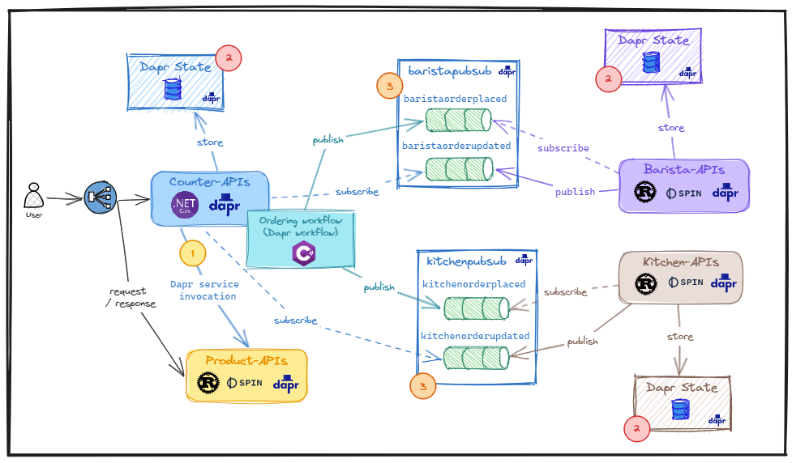

# Part 3: WebAssembly, Docker container, Dapr, and Kubernetes better together - Prepare Dapr components and daprize the coffee backend services

In this post, we will explore [`Dapr`](https://github.com/dapr/dapr) capabilities such as service invocation, pubsub, and state management. And we will use [`Dapr API`](https://docs.dapr.io/reference/api/) for communicating as well as storing the data between pologlot applications (Rust - WASM/WASI with Spin and .NET with container approaches).

## Overall Dapr components usage



### 1. Service invocation

We leverage [Dapr .NET SDK](https://github.com/dapr/dotnet-sdk) to invoke `product-api` from `counter-api`.

```cs
// ref: https://github.com/thangchung/dapr-labs/blob/main/polyglot/counter-api/Infrastructure/ItemDaprGateway.cs#L14

var productAppName = config.GetValue("ProductCatalogAppDaprName", "product-api-dapr-http");
        logger.LogInformation("ProductCatalogAppDaprName: {0}", productAppName);

var httpResponseMessage = await daprClient.InvokeMethodAsync<List<ItemDto>>(
    HttpMethod.Get,
    productAppName,
    "v1-get-item-types");
```

### 2. State management

As mentioned in previous part, we use Dapr state management for storing the state of `counter-api` (use `Dapr .NET SDK`), `barista-api` (use [`Dapr State Management API`](https://docs.dapr.io/reference/api/state_api/)), and `kitchen-api` (use [`Dapr State Management API`](https://docs.dapr.io/reference/api/state_api/)).

The sample code for storing data in `counter-api` as following:

```cs
// ref: https://github.com/thangchung/dapr-labs/blob/main/polyglot/counter-api/Activities/AddOrderActivity.cs#L44

await daprClient.SaveStateAsync("statestore", "order-list", new List<Guid> { order.Id });
```

Or,

```cs
// ref: https://github.com/thangchung/dapr-labs/blob/main/polyglot/counter-api/UseCases/OrderFulfillmentQuery.cs#L46

var mulitpleStateResult = await daprClient.GetBulkStateAsync("statestore", orderGuidProcceed, parallelism: 1, cancellationToken: cancellationToken);
```

Dapr component:

```yaml
# ref: statestore.yaml

apiVersion: dapr.io/v1alpha1
kind: Component
metadata:
  name: statestore
spec:
  type: state.redis
  version: v1
  metadata:
    - name: redisHost
      value: localhost:6379
    - name: redisPassword
      value: ""
    - name: actorStateStore
      value: "true"
```

### 3. Pub/sub

Pub/sub is a popular pattern for Event-driven Architecture (EDA). In this application, we use both `Dapr .NET SDK` and [Dapr pub/sub API](https://docs.dapr.io/reference/api/pubsub_api/).

Publish a message, see below

```cs
// ref: https://github.com/thangchung/dapr-labs/blob/main/polyglot/counter-api/Activities/AddOrderActivity.cs#L109

await daprClient.PublishEventAsync(
    "baristapubsub",
    nameof(BaristaOrderPlaced).ToLowerInvariant(),
    @event.Value);
```

Or, in `barista-api`:

```rs
// ref: https://github.com/thangchung/dapr-labs/blob/main/polyglot/barista-api/src/lib.rs#L119

fn pub_order_updated(dapr_url: &str, pubsub_name: &str, topic: &str, e: BaristaOrderUpdated) {
    let url = format!("{}/v1.0/publish/{}/{}", dapr_url, pubsub_name, topic);
    println!("url: {}", url);

    let body = bytes::Bytes::from(json!(e).to_string());
    let result = spin_sdk::outbound_http::send_request(
        http::Request::builder()
            .header("Content-Type", "application/json")
            .method("POST")
            .uri(url)
            .body(Some(body))
            .unwrap(),
    );
}
```

Subscribe a message, with .NET in `counter-api`:

```cs
// ref: https://github.com/thangchung/dapr-labs/blob/main/polyglot/counter-api/UseCases/OrderUpdatedCommand.cs#L15

builder.MapPost("/dapr_subscribe_BaristaOrderUpdated", async (BaristaOrderUpdated @event, ISender sender) =>
            await sender.Send(new OrderUpdatedCommand(
                    @event.OrderId,
                    @event.ItemLines)));
```

Or, in Rust with `barista-api`:

```rs
// ref: https://github.com/thangchung/dapr-labs/blob/main/polyglot/barista-api/src/lib.rs#L71

router.post("/dapr_subscribe_BaristaOrdered", post_place_order_handler);
```

Dapr components:

```yaml
# barista_pubsub.yaml

apiVersion: dapr.io/v1alpha1
kind: Component
metadata:
  name: baristapubsub
  namespace: default
spec:
  type: pubsub.redis
  version: v1
  metadata:
    - name: redisHost
      value: localhost:6379
    - name: redisPassword
      value: ""
```

```yaml
# kitchen_pubsub.yaml

apiVersion: dapr.io/v1alpha1
kind: Component
metadata:
  name: kitchenpubsub
  namespace: default
spec:
  type: pubsub.redis
  version: v1
  metadata:
    - name: redisHost
      value: localhost:6379
    - name: redisPassword
      value: ""
```

```yaml
# barista_order_placed_subscription.yaml

apiVersion: dapr.io/v1alpha1
kind: Subscription
metadata:
  name: barista-ordered-subscription
spec:
  topic: baristaorderplaced
  route: /dapr_subscribe_BaristaOrdered
  pubsubname: baristapubsub
```

```yaml
# kitchen_order_placed_subscription.yaml

apiVersion: dapr.io/v1alpha1
kind: Subscription
metadata:
  name: kitchen-ordered-subscription
spec:
  topic: kitchenorderplaced
  route: /dapr_subscribe_KitchenOrdered
  pubsubname: kitchenpubsub
```

```yaml
# barista_updated_subscription.yaml

apiVersion: dapr.io/v1alpha1
kind: Subscription
metadata:
  name: barista-updated-subscription
spec:
  topic: baristaorderupdated
  route: /dapr_subscribe_BaristaOrderUpdated
  pubsubname: baristapubsub
```

```yaml
# kitchen_updated_subscription.yaml

apiVersion: dapr.io/v1alpha1
kind: Subscription
metadata:
  name: kitchen-updated-subscription
spec:
  topic: kitchenorderupdated
  route: /dapr_subscribe_KitchenOrderUpdated
  pubsubname: kitchenpubsub

```

## Set up and run apps

Now, let installing `dapr` in your local machine (Windows 11 - WSL2 - Ubuntu 22.04)

```sh
> wget -q https://raw.githubusercontent.com/dapr/cli/master/install/install.sh -O - | /bin/bash
> dapr init
> dapr --version
CLI version: 1.11.0
Runtime version: 1.11.2
```

Create `.env` with content:

```sh
DAPR_URL=http://localhost:3500
```

### Run `product-api`

```sh
> cd product-api && \
    spin build && \
    dapr run \
    --app-id productapi \
    --app-port 5001 \
    --resources-path ../components \
    --config ../components/daprConfig.yaml \
    -- spin up --listen 0.0.0.0:5001
```

### Run `counter-api`

```sh
> dapr run \
    --app-id counterapi \
    --app-port 5002 \
    --dapr-http-port 3500 \
    --resources-path components \
    --config components/daprConfig.yaml \
    -- dotnet run --project counter-api/counter-api.csproj
```

### Run `barista-api`

```sh
> cd barista-api && \
    spin build && \
    dapr run \
    --app-id baristaapi \
    --app-port 5003 \
    --resources-path ../components \
    --config ../components/daprConfig.yaml \
    -- spin up --listen 0.0.0.0:5003 --env DAPR_URL=${DAPR_URL}
```

### Run `kitchen-api`

```sh
> cd kitchen-api && \
    spin build && \
    dapr run \
    --app-id kitchenaapi \
    --app-port 5004 \
    --resources-path ../components \
    --config ../components/daprConfig.yaml \
    -- spin up --listen 0.0.0.0:5004 --env DAPR_URL=${DAPR_URL}
```

Go to Rest Client at [client.local.http](https://github.com/thangchung/dapr-labs/blob/main/polyglot/client.local.http) to play around with it.

## Summary

In this part, we install and play around with `Dapr CLI` on the local machine. Next part, we will deploy it to Kubernetes (k3d), and it's going to be interesting part of this series.
